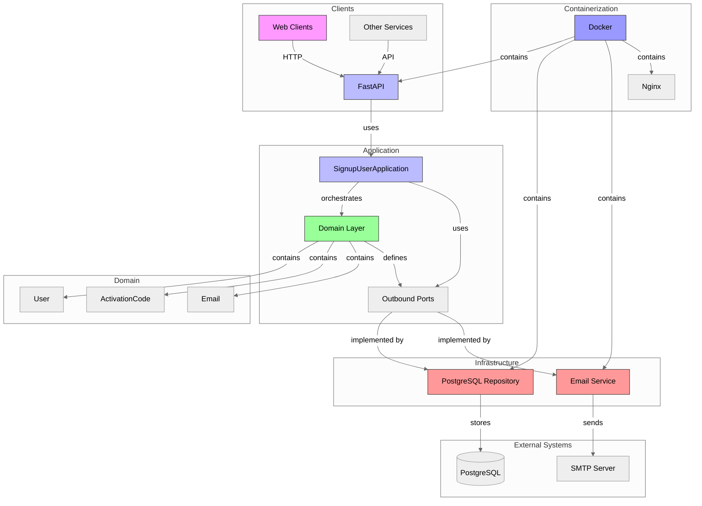
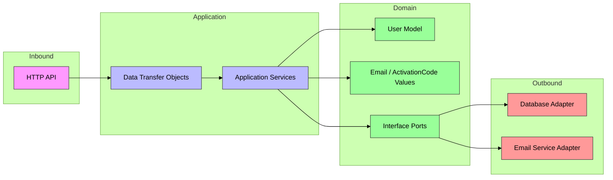

# Signup - Clean Architecture Application with FastAPI and Docker
[](https://github.com/JeremySomsouk/SpookySignUp/actions/workflows/ci.yml)

[](https://www.docker.com/)

[](https://fastapi.tiangolo.com/)


## Project Overview

A modern application built with Clean Architecture, Domain-Driven Design, and FastAPI, featuring:
- Hexagonal architecture with clear separation of concerns
- Docker containerization
- PostgreSQL database integration
- Email service integration: Local but easily replaceable
- Comprehensive testing strategy

---

## Architecture
### High-Level Component Diagram


### Hexagonal architecture


---

# How to run this application
```bash
docker-compose up --build
```

## Test the API
1) Register a user
```bash
curl -X POST http://localhost:8080/api/v1/users/register \
  -H "Content-Type: application/json" \
  -d '{"email": "account@spookymotion.com", "password": "mypassword123"}'
```

2) Retrieve the email sent here: http://localhost:8025/
3) Activate the account 
```bash
curl -X POST http://localhost:8080/api/v1/users/activate \
  -u "account@spookymotion.com:mypassword123" \
  -H "Content-Type: application/json" \
  -d '{"activation_code": "{{ the retrieved activation code }}"}'
```

# How to launch the automated tests
## For unit tests ran from the container
```bash
docker-compose up --build
```
```bash
docker-compose exec app pytest tests/unit/
```

## For all tests from local using testcontainers
Only if pytest installed locally, and docker compose not up
```bash
pytest
```

# API Documentation
The API is self-documenting with:

Swagger UI: http://localhost:8080/docs

## User Registration Endpoints
   Endpoint | Method | Description | Request Body | Response                          | Status Codes | Authentication |
 |----------|--------|-------------|--------------|-----------------------------------|--------------|----------------|
 | `/api/v1/users/register` | POST | Register a new user | `RegisterUserRequest` (email, password) | `UserResponse` (email, is_active) | 201: Created, 400: Bad Request, 422: Validation Error | None |
 | `/api/v1/users/activate` | POST | Activate a user account | `ActivateUserRequest` (activation_code) | `UserResponse`  (email, is_active)                   | 200: OK, 400: Bad Request, 401: Unauthorized, 422: Validation Error | Basic Auth |

## Example queries
Registration
```bash
curl -X POST http://localhost:8080/api/v1/users/register \
  -H "Content-Type: application/json" \
  -d '{"email": "account@spookymotion.com", "password": "mypassword123"}'
```

Activation
```bash
curl -X POST http://localhost:8080/api/v1/users/activate \
  -u "account@spookymotion.com:mypassword123" \
  -H "Content-Type: application/json" \
  -d '{"activation_code": "9494"}'
```

